# 📸 Prints e Demonstração do Funcionamento

## 1. Active Directory (AD), DNS e GPO

Suas imagens aqui

---

## 2. Servidor FTP

As figuras a seguir demonstram o funcionamento do servidor FTP configurado na instância EC2 da AWS.
Cada etapa evidencia a infraestrutura criada, as regras de segurança aplicadas e a conectividade entre o cliente (máquina local) e o servidor.

### **Figura 1 – Painel da Instância EC2 da FTP na AWS**

A Figura 1 apresenta a instância EC2 utilizada para hospedar o servidor FTP.
Essa instância executa o sistema operacional Ubuntu Server 24.04 LTS, utiliza o tipo t3.micro e possui IP privado 172.31.17.229.

----

## 3. Servidor VPN (OpenVPN)

As figuras a seguir demonstram o funcionamento do servidor VPN configurado na instância EC2 da AWS.
Cada etapa evidencia a infraestrutura criada, as regras de segurança aplicadas e a conectividade entre o cliente (máquina local) e o servidor, comprovando o correto funcionamento do serviço OpenVPN.

### **Figura 1 – Painel da Instância EC2 da VPN na AWS**

A Figura 1 apresenta a instância EC2 utilizada para hospedar o servidor OpenVPN.
Essa instância executa o sistema operacional Ubuntu Server 24.04 LTS, utiliza o tipo t3.micro e possui IP privado 172.31.17.170.
Nela foi instalado e configurado o serviço OpenVPN, responsável por gerenciar o túnel de comunicação segura entre o cliente e a rede privada na AWS.

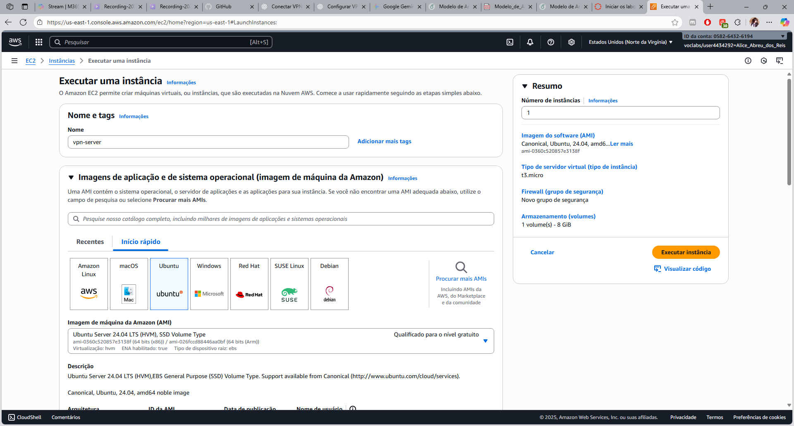
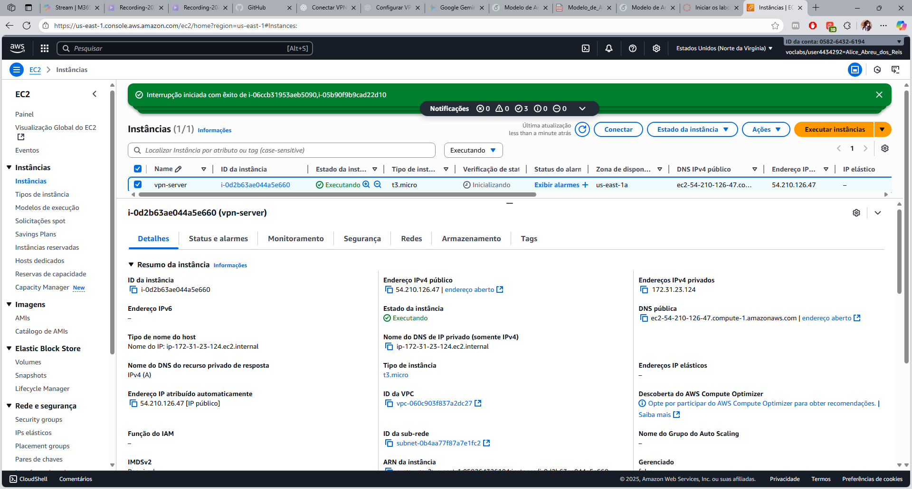

---

### **Figura 2 – Regras de Segurança do Servidor VPN (Security Group)**

A Figura 2 mostra o Security Group configurado para a instância VPN.

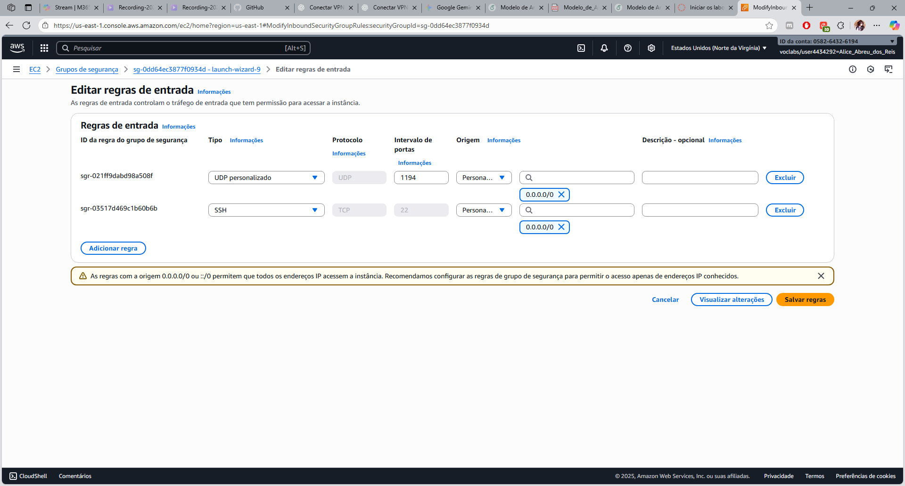

---

### **Figura 3 – Conexão via SSH com a instância EC2**

A Figura 3 demonstra o processo de conexão via SSH à instância EC2 na AWS.
Utilizou-se o Windows PowerShell e a chave privada vpn-chave.pem para autenticação segura do usuário ubuntu.
Ao realizar a primeira conexão, o sistema exibe o aviso de autenticidade da chave (fingerprint), pedindo confirmação do usuário antes de prosseguir.
Esse procedimento garante que a comunicação com o servidor seja criptografada e autenticada de forma segura.

---

### **Figura 4 – Instalação do OpenVPN**

Na Figura 4, é apresentada a etapa de instalação e configuração inicial do serviço OpenVPN no servidor Ubuntu hospedado na AWS.
Durante esse processo, foram definidos os seguintes parâmetros:

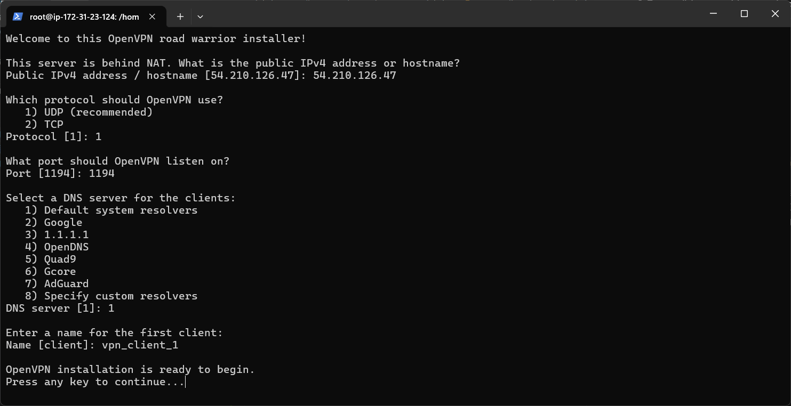

----

### **Figura 5 – Verificação do status do serviço OpenVPN**

A Figura 5 apresenta a execução do comando `systemctl status openvpn` na instância Ubuntu. O status `active (exited)` indica que o serviço OpenVPN foi iniciado corretamente, enquanto `enabled` confirma que ele está configurado para iniciar automaticamente junto ao sistema. Esse passo assegura que o servidor está pronto para aceitar conexões de clientes via VPN.

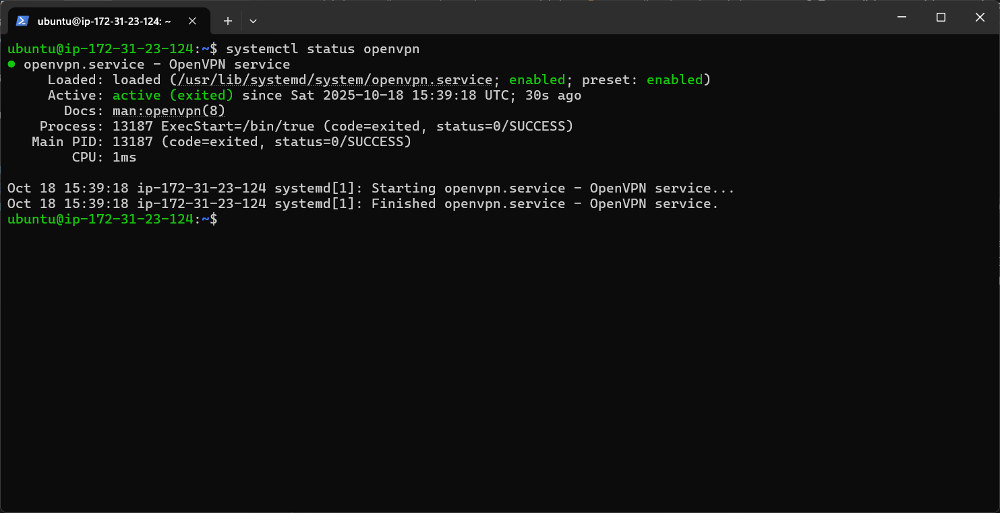

---

### **Figura 6 – Verificação do status do serviço OpenVPN**

A Figura 6 mostra novamente a verificação do status do serviço OpenVPN, reforçando que ele está ativo e configurado para inicialização automática. Essa confirmação é essencial para garantir a disponibilidade do servidor antes da conexão de clientes.

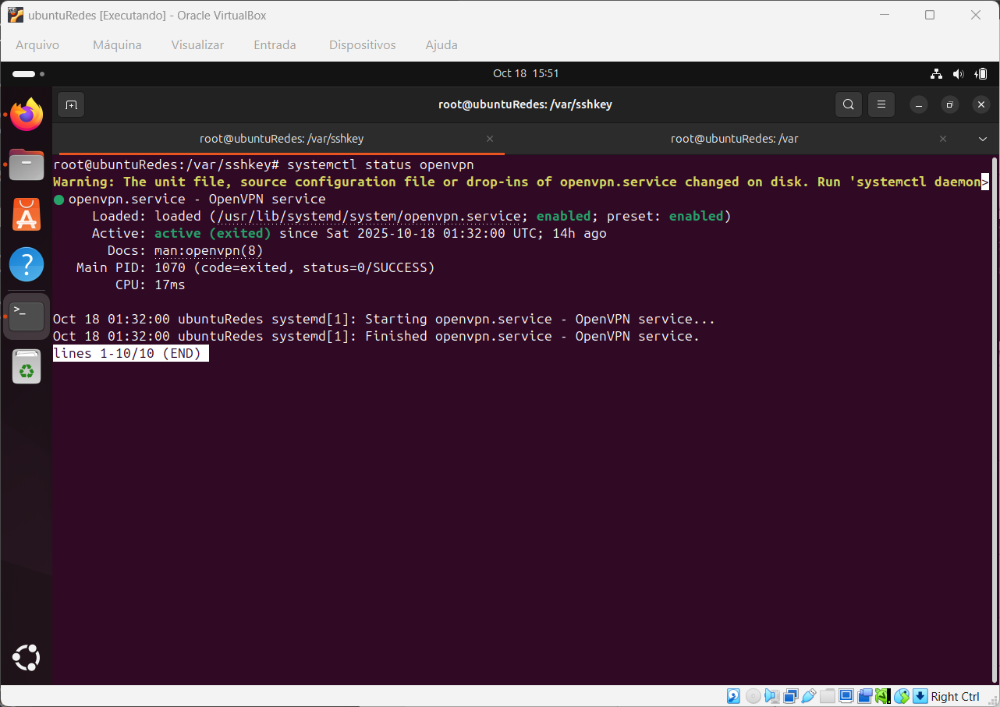

----

### **Figura 7 – Transferência do Arquivo de Configuração do Cliente (.ovpn)**

A Figura 7 ilustra o uso do comando `scp` para copiar o arquivo de configuração do cliente (`vpn_client_1.ovpn`) do servidor EC2 para a máquina local. Esse arquivo contém todas as informações necessárias para que o cliente estabeleça a conexão VPN com o servidor.

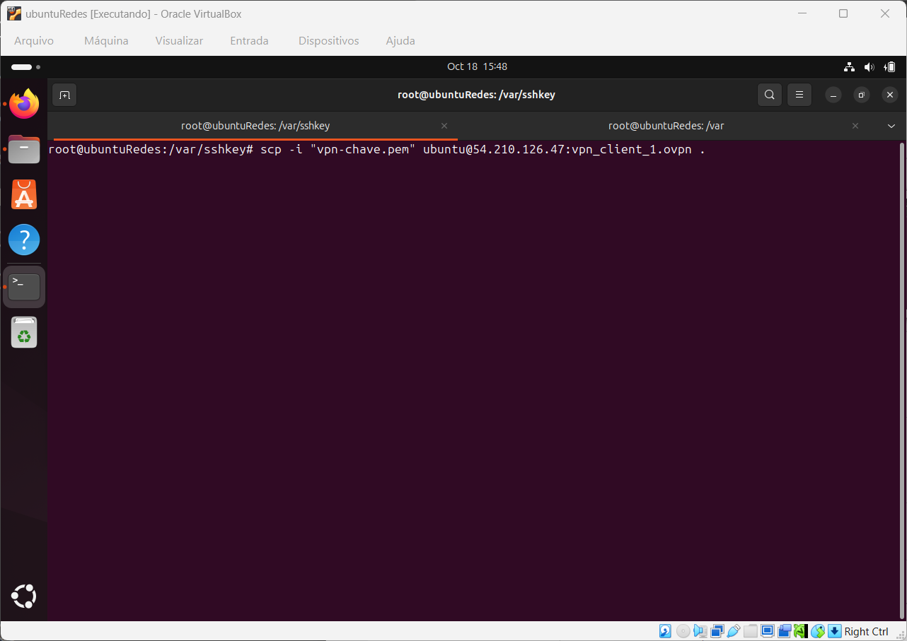

----

### **Figura 8 – Início da Conexão VPN pelo Cliente**

A Figura 8 demonstra a execução do comando `openvpn --config vpn_client_1.ovpn` no terminal do cliente. Esse passo inicia o tunelamento seguro entre o cliente e o servidor, utilizando o IP público do servidor (54.210.126.47) e a porta 1194.

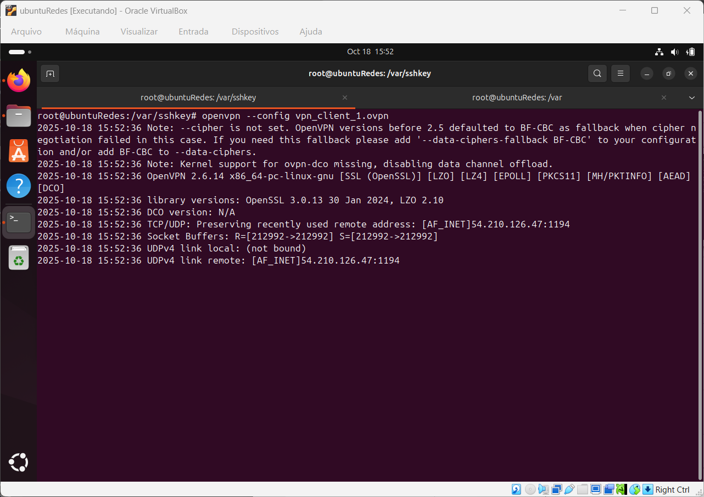

----

### **Figura 9 – Teste de Conectividade (Ping)**

A Figura 9 apresenta a execução de um teste de conectividade (`ping`) para verificar se a conexão VPN foi estabelecida corretamente. Esse passo confirma que o cliente consegue se comunicar com a rede remota através do túnel seguro.

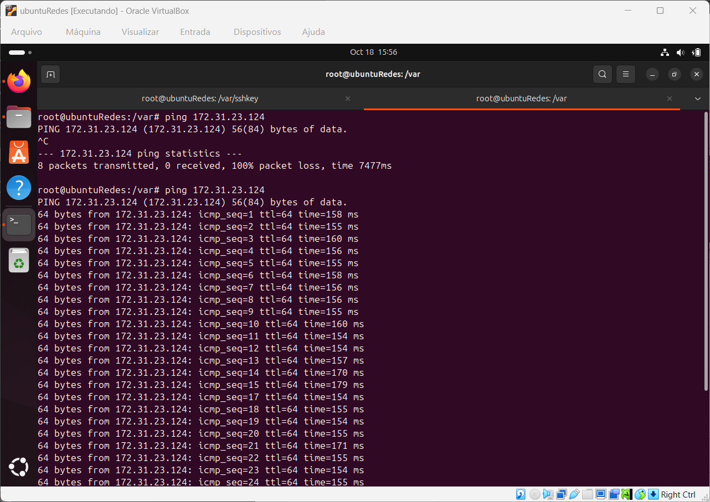

----

## 4. Servidor DHCP

As figuras a seguir demonstram o funcionamento do servidor DHCP configurado na VM DebianSrv.

Cada etapa evidencia a criação da máquina, configuração da rede e distribuição de endereços IP para clientes na rede interna, confirmando que o serviço está ativo e funcional

### **Figura 1 – Máquina Virtual DebianSrv01 e Win11Srv01 no Oracle VM VirtualBox**

A Figura 1 apresenta a máquina virtual criada para hospedar o servidor DHCP e o cliente que irá receber o IP.

A VM executa Debian 13, possui duas interfaces de rede:
enp0s3: modo NAT, usada para acesso à internet.

enp0s8: modo rede interna, utilizada para fornecer endereços IP aos clientes.

A VM executa Windows 11, possui uma interface rede interna, utilizada para receber endereço IP durante o teste.

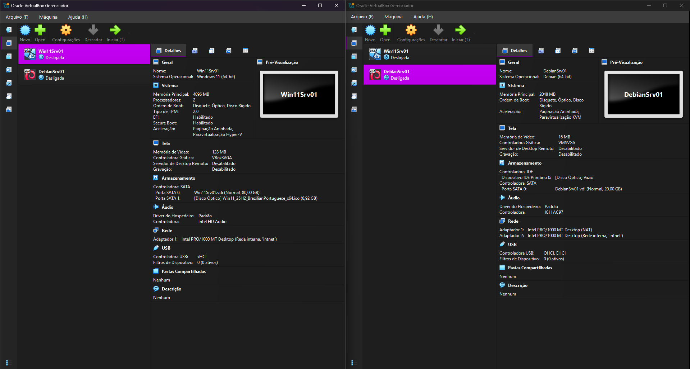

### **Figura 2 – Configuração das Interfaces de Rede**

A Figura 2 mostra o conteúdo do arquivo `/etc/network/interfaces`, evidenciando que:
- A interface enp0s3 recebe IP automaticamente via DHCP.
- A interface enp0s8 possui IP fixo 192.168.1.1, servindo como gateway da rede interna.

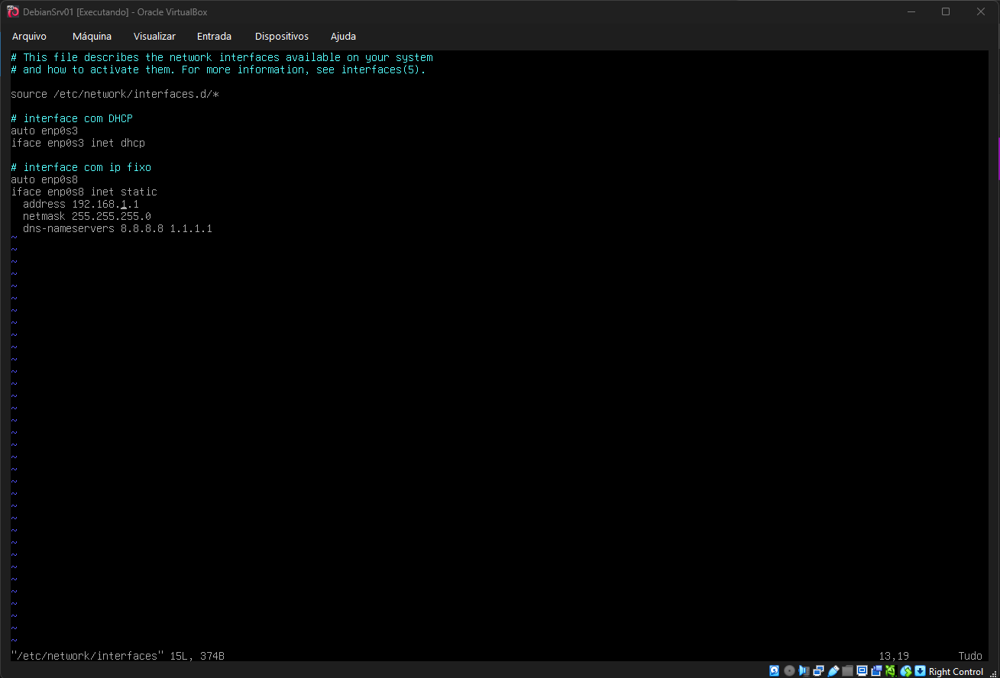

### Figura 3 – Verificação das Interfaces de Rede

A Figura 3 demonstra a execução do comando `ip a` na VM DebianSrv, mostrando que as interfaces de rede estão corretamente configuradas:

- enp0s3 obtendo IP automaticamente via DHCP.
- enp0s8 com IP fixo 192.168.1.1, servindo como gateway da rede interna.

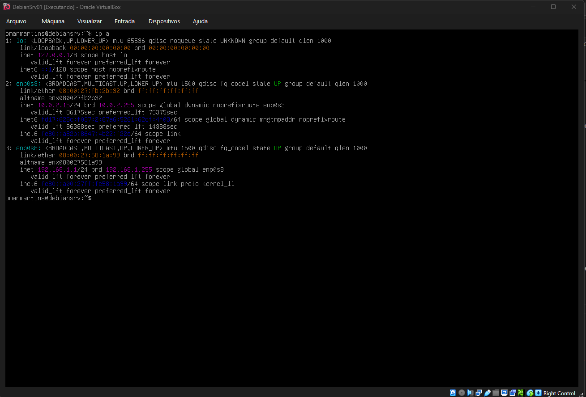

### Figura 4 – Definição da Interface do DHCP

A Figura 4 mostra o arquivo `/etc/default/isc-dhcp-server`, onde a interface de atendimento do DHCP foi configurada como enp0s8.

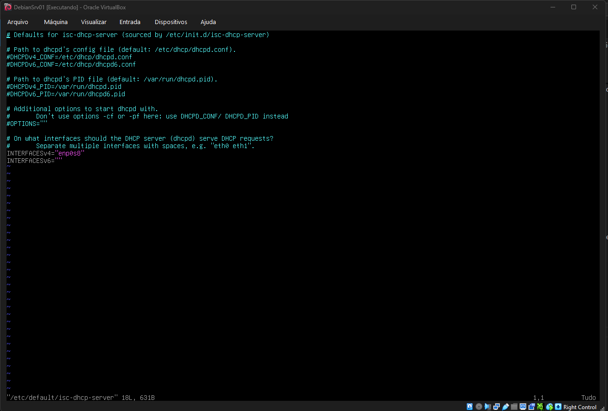

### Figura 5 – Configuração do Escopo DHCP

A Figura 5 exibe o conteúdo do arquivo /etc/dhcp/dhcpd.config, incluindo:

- Sub-rede interna 192.168.1.0/24
- Faixa de IPs distribuída aos clientes: 192.168.1.51 - 192.168.1.100
- Gateway: 192.168.1.1
- Servidores DNS: 8.8.8.8 e 1.1.1.1

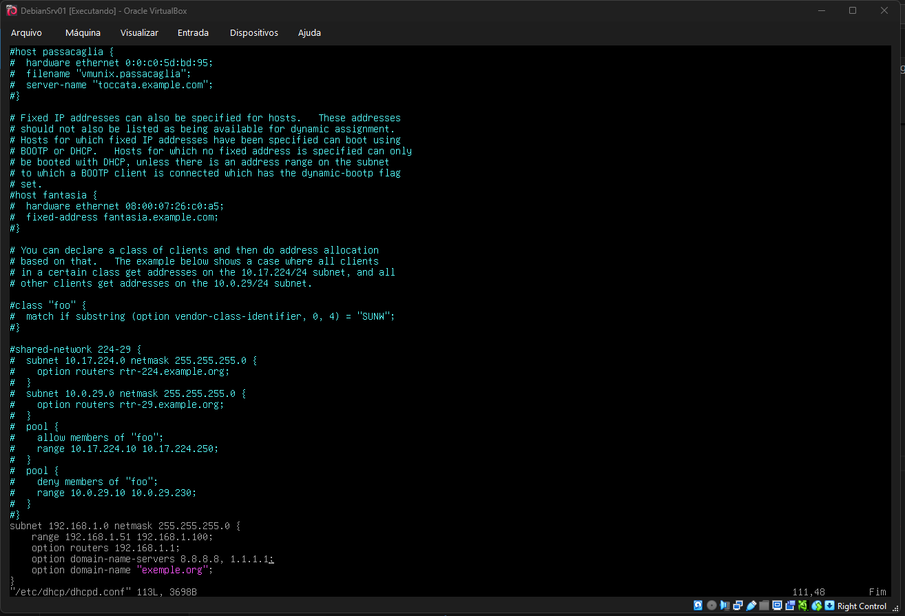

### Figura 6 – Reinicialização e Status do Serviço DHCP

A Figura 6 demonstra a execução dos comandos para reiniciar e verificar o status do isc-dhcp-server, confirmando que o serviço está ativo e funcionando corretamente.

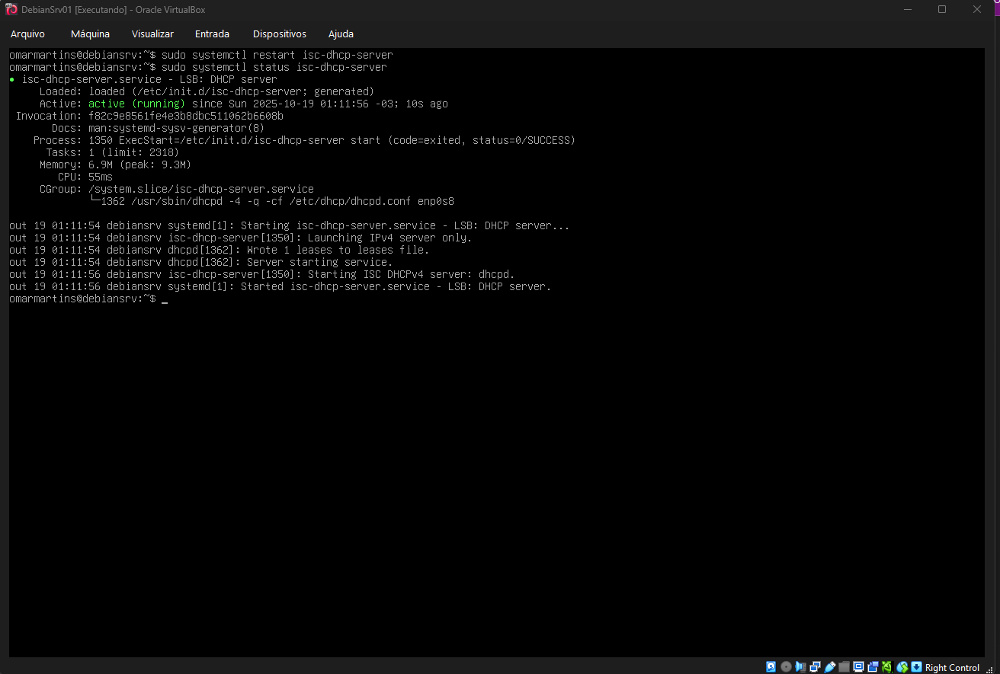

### Figura 7 – Cliente Recebendo Endereço IP

A Figura 7 apresenta uma segunda VM com Windows 11 conectada à rede interna da DebianSrv executando o comando `ipconfig` no terminal.

O cliente recebeu automaticamente um endereço IP dentro da faixa definida no escopo DHCP (192.168.1.51 - 192.168.1.100), confirmando que o servidor DHCP está ativo e funcionando corretamente.

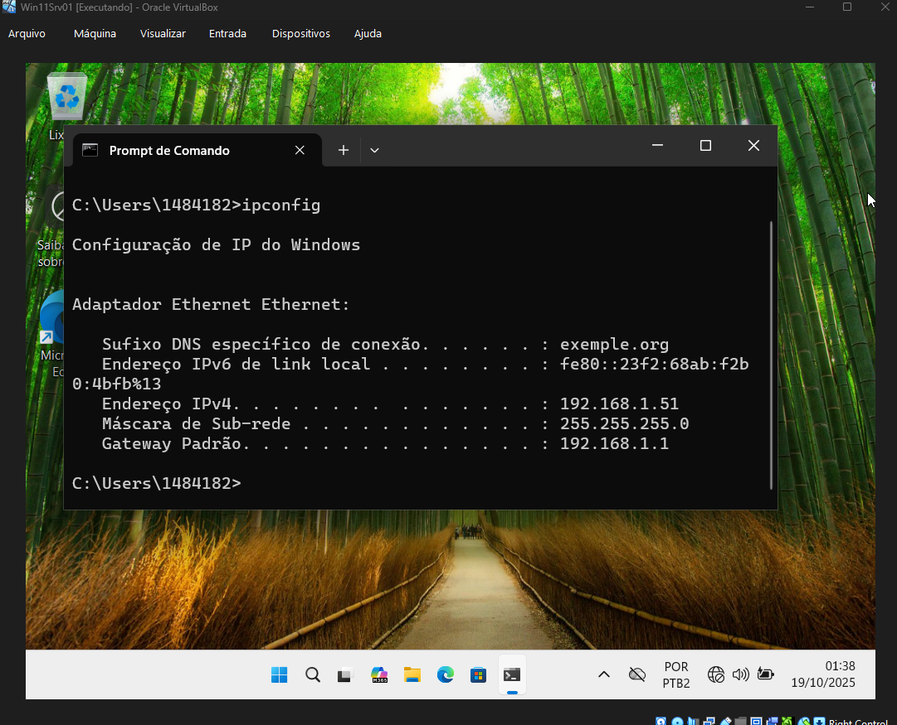

## 5. Servidor web e banco de dados

As figuras a seguir demonstram o funcionamento do ambiente de servidor web e banco de dados configurado na AWS.  
Cada etapa evidencia um componente da arquitetura e comprova o correto funcionamento dos serviços,  
desde a infraestrutura e segurança até os testes de integração entre API e banco de dados.

---

### **Figura 1 – Painel da Instância EC2 na AWS com o Elastic IP associado e Security Group configurado**

A Figura 1 apresenta a instância EC2 configurada para hospedar o servidor web.  
Essa instância executa o sistema operacional **Ubuntu 24.04 LTS** e possui um **Elastic IP**, garantindo endereço público fixo mesmo após reinicializações.  
É nela que residem o **Nginx** e a **aplicação Node.js**, responsáveis por servir o frontend e a API do sistema CRUD.

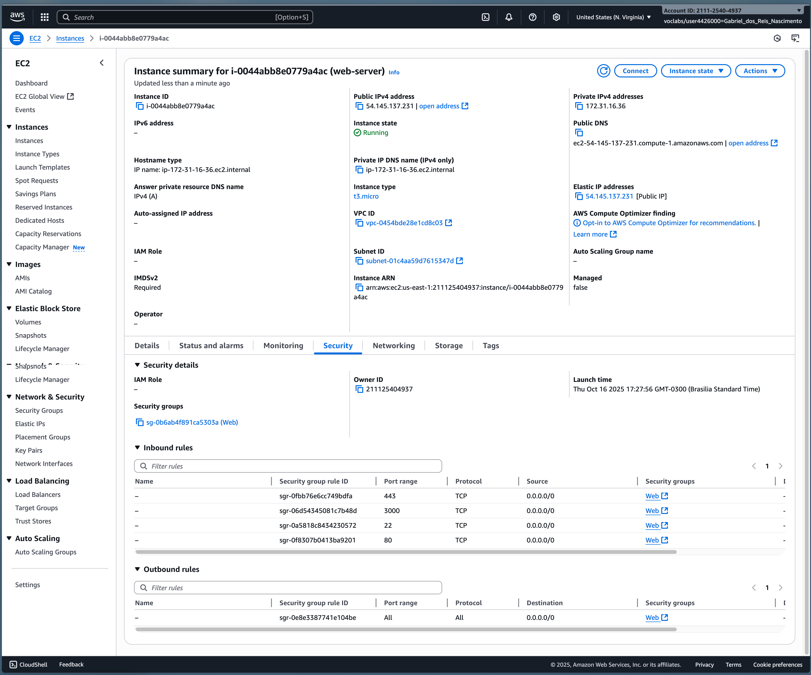

---

### **Figura 2 – Painel do Banco de Dados RDS PostgreSQL com o endpoint e Security Group configurado**

A Figura 2 exibe o serviço **Amazon RDS** utilizado para o banco de dados da aplicação.  
O banco de dados **PostgreSQL** foi criado com acesso restrito apenas à instância EC2, por meio de um Security Group dedicado, assegurando que as conexões externas sejam bloqueadas.  
Esse banco armazena as tabelas utilizadas pelo sistema CRUD (como usuários e produtos).

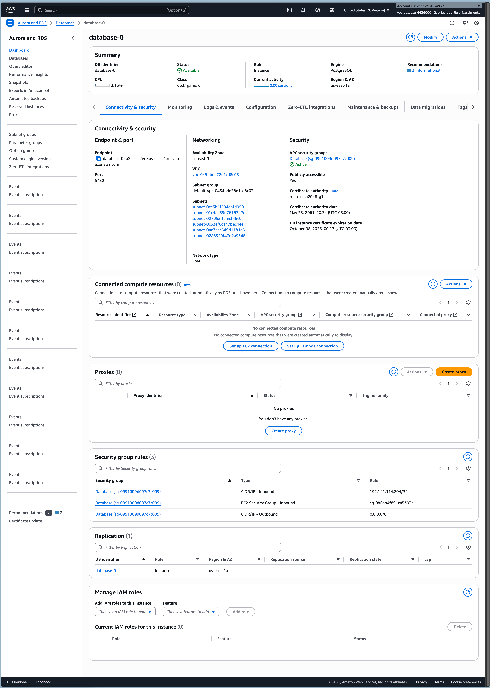

---

### **Figura 3 – Regras de Segurança do Servidor Web (Security Group)**

A Figura 3 mostra as regras de segurança aplicadas ao servidor web.  
Apenas as portas necessárias foram liberadas: SSH (22) para administração, HTTP (80) e HTTPS (443) para acesso público, e 3000 para comunicação com a API Node.js.  
Para saída, todas as portas (0.0.0.0/0) estão liberadas, permitindo que o servidor faça requisições externas conforme necessário.

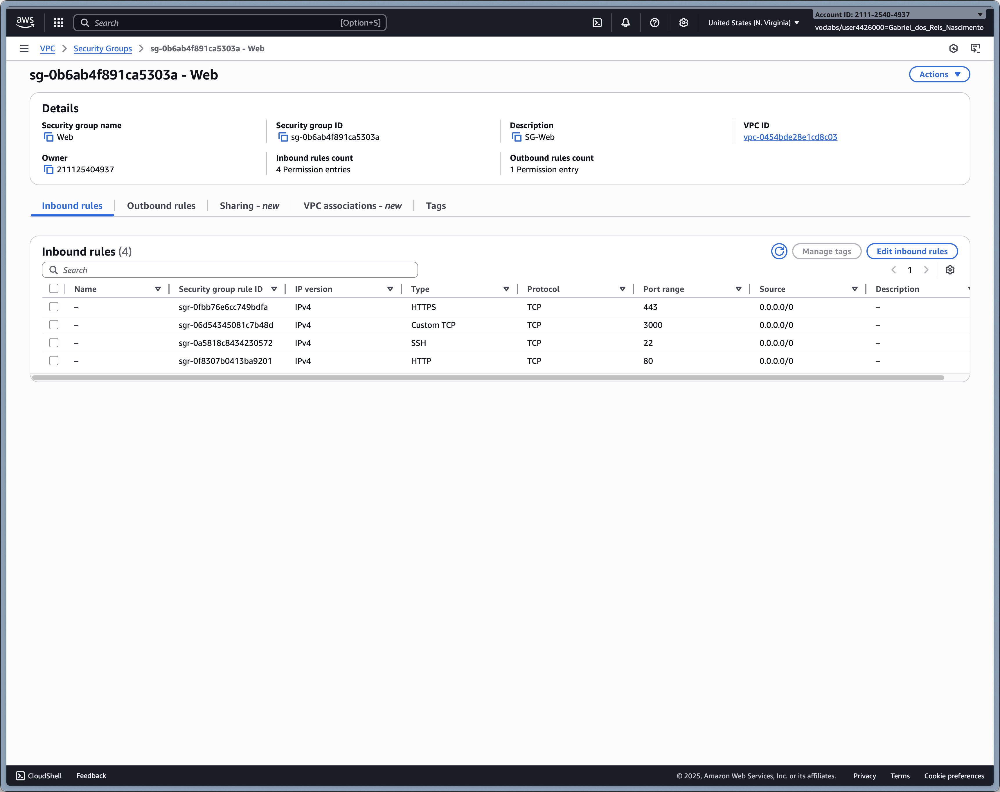

---

### **Figura 4 – Regras de Segurança do Banco de Dados (Security Group)**

A Figura 4 apresenta o Security Group do banco de dados PostgreSQL.  
Ele permite conexões apenas provenientes do grupo de segurança do servidor web, na porta 5432, bloqueando todo o tráfego externo.  
Para saída, todas as portas (0.0.0.0/0) estão liberadas, permitindo que o servidor faça requisições externas conforme necessário.

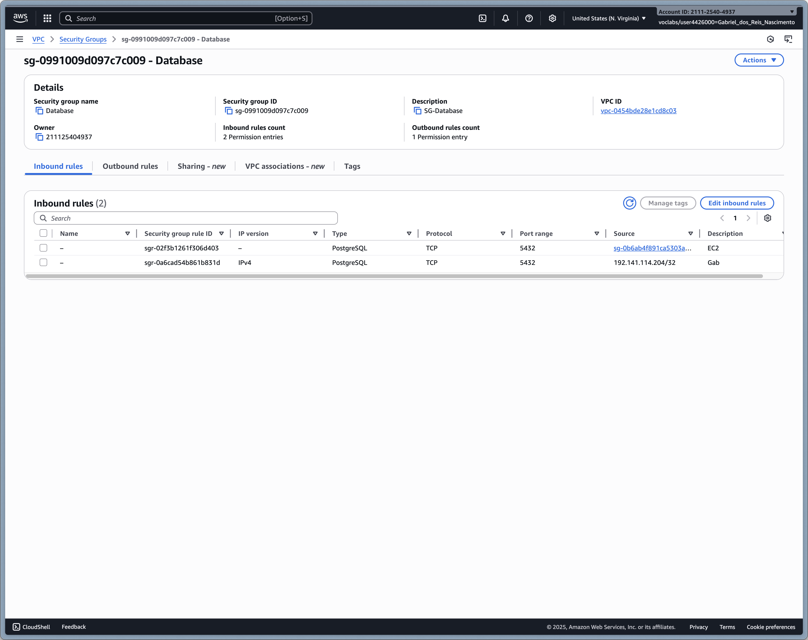
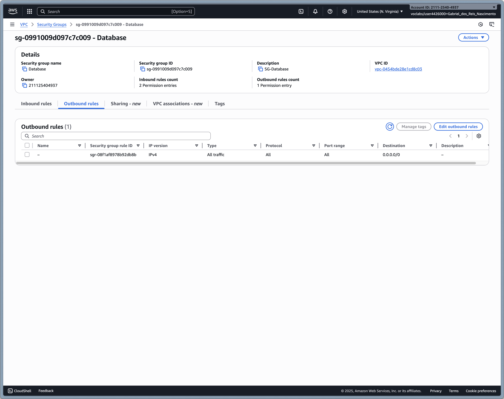

---

### **Figura 5 – Acesso SSH ao Servidor Web**

A Figura 5 demonstra o acesso SSH ao servidor EC2 e a execução do comando `docker ps` e o comando `docker logs [nome-do-container]` para verificar os logs do container da aplicação Node.js em execução.  
Evidenciando que o container da aplicação Node.js está em execução e está funcionando corretamente.

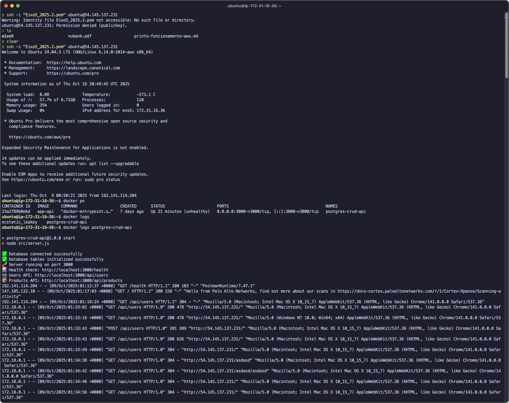

---

### **Figura 6 – Variáveis de Ambiente no Container da API**

A Figura 6 mostra o acesso ao container da API Node.js via `docker exec` e a execução do comando `env`, exibindo as variáveis de ambiente configuradas dentro do container em execução.
Essas variáveis incluem as credenciais e configurações necessárias para conexão com o banco de dados PostgreSQL no RDS.

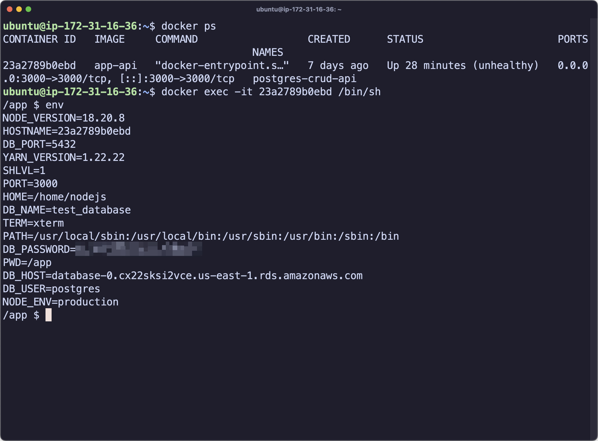

---

### **Figura 7 – Configuração do Nginx**

A Figura 7 mostra a configuração do **Nginx** utilizada como proxy reverso.
Essa configuração direciona as requisições HTTP da rota `/api` para a aplicação Node.js interna, enquanto serve os arquivos estáticos do frontend diretamente.

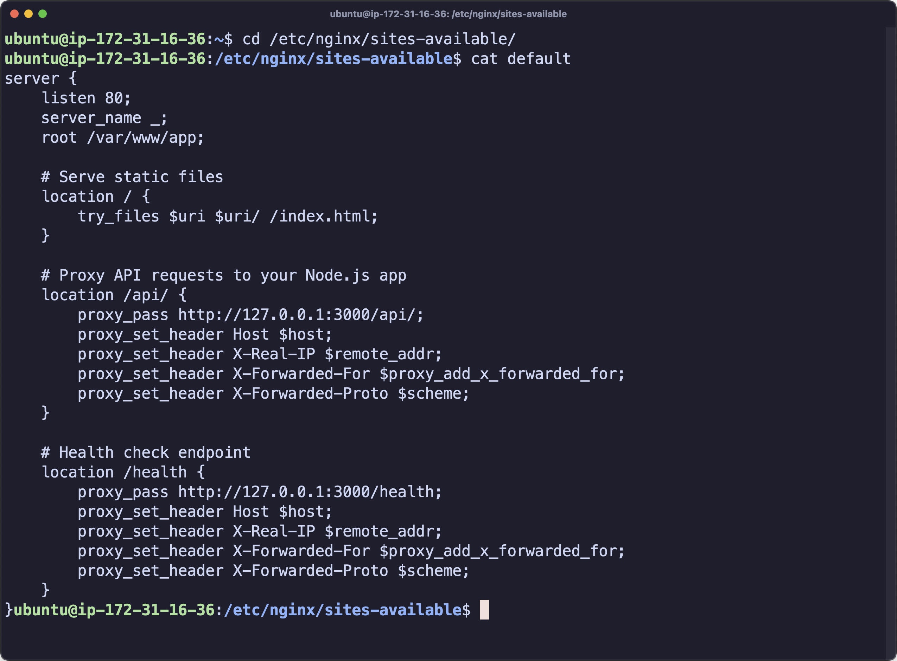

---

### **Figura 8 – Interface do CRUD no Navegador**

A Figura 8 apresenta a interface do sistema CRUD sendo servida pelo Nginx, acessada diretamente através do **Elastic IP** da instância EC2.
Essa tela comprova que o servidor web está ativo e a aplicação está disponível publicamente.

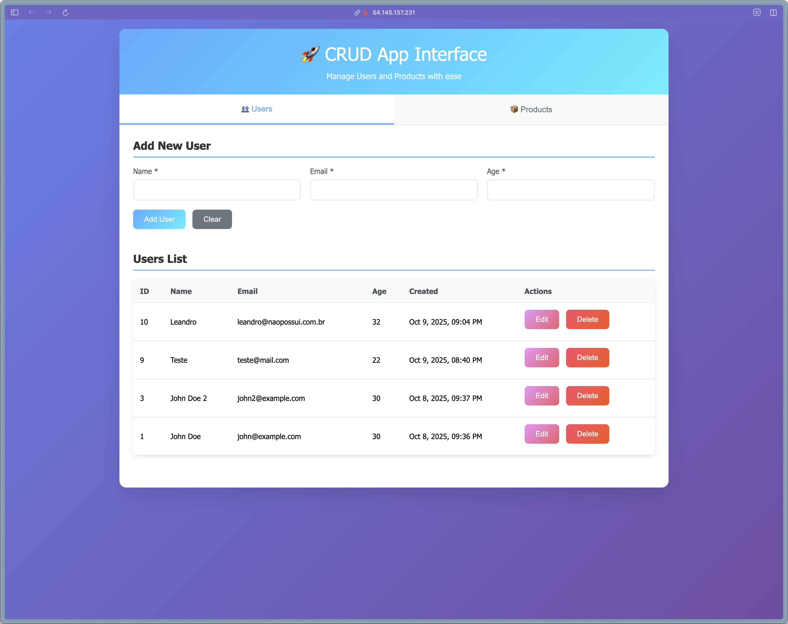

---

### **Figura 9 – Requisição POST no Postman**

A Figura 9 demonstra o envio de uma requisição POST para a API utilizando o Postman.  
O retorno JSON confirma que o servidor web recebeu a requisição, processou os dados e gravou o novo registro no banco de dados PostgreSQL.

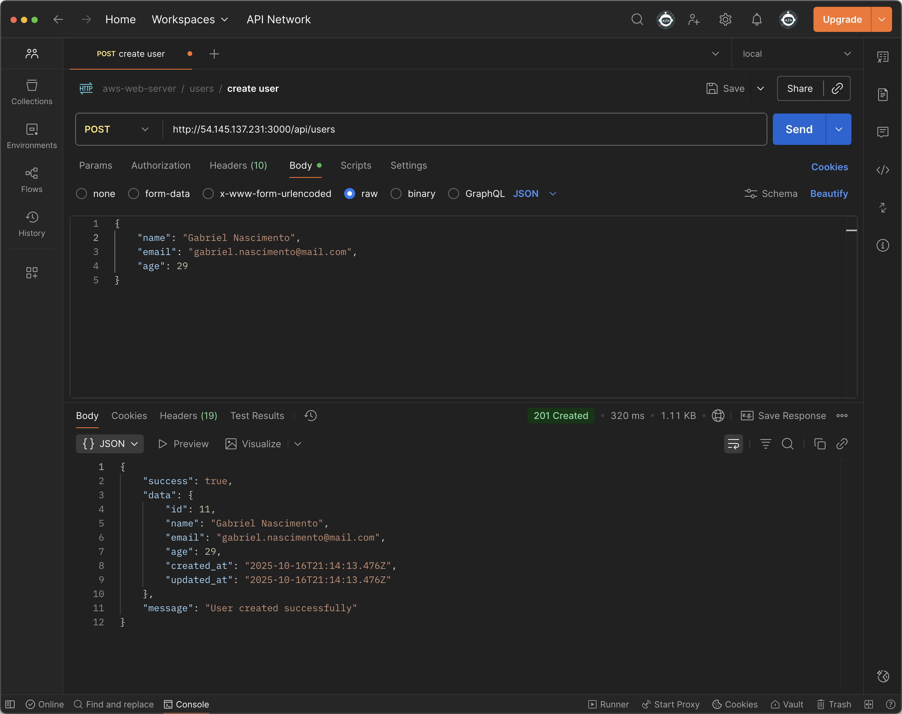

---

### **Figura 10 – Registro Inserido no Banco de Dados (DataGrip)**

A Figura 10 exibe o banco de dados acessado via **DataGrip**, comprovando que o registro inserido através da requisição POST na API na Figura 9 foi armazenado na tabela `users`.  
Essa evidência confirma a integração entre o servidor web na EC2 e o banco de dados PostgreSQL no RDS.

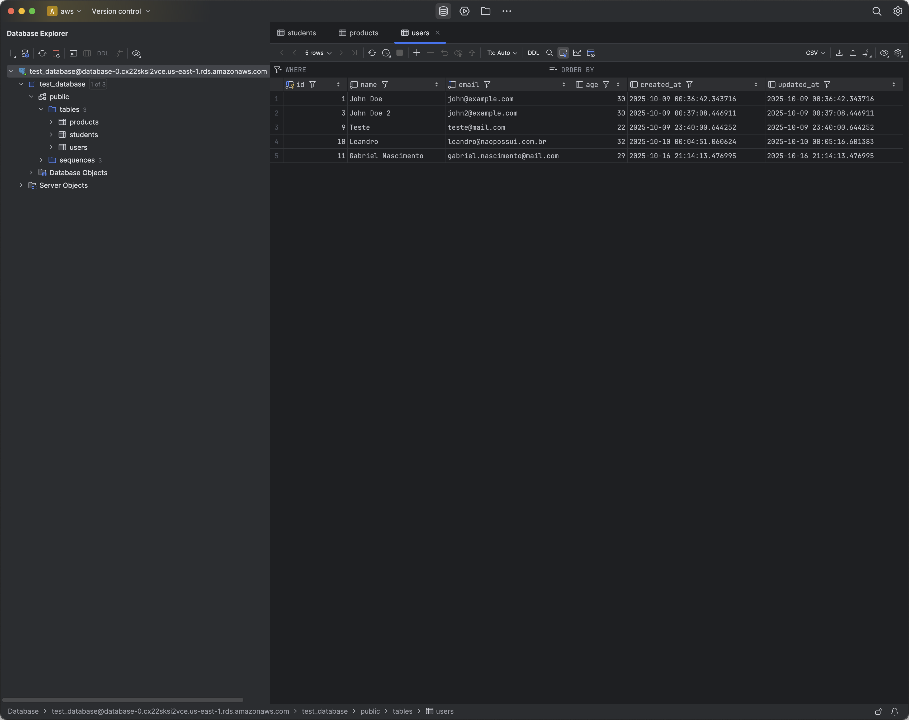
